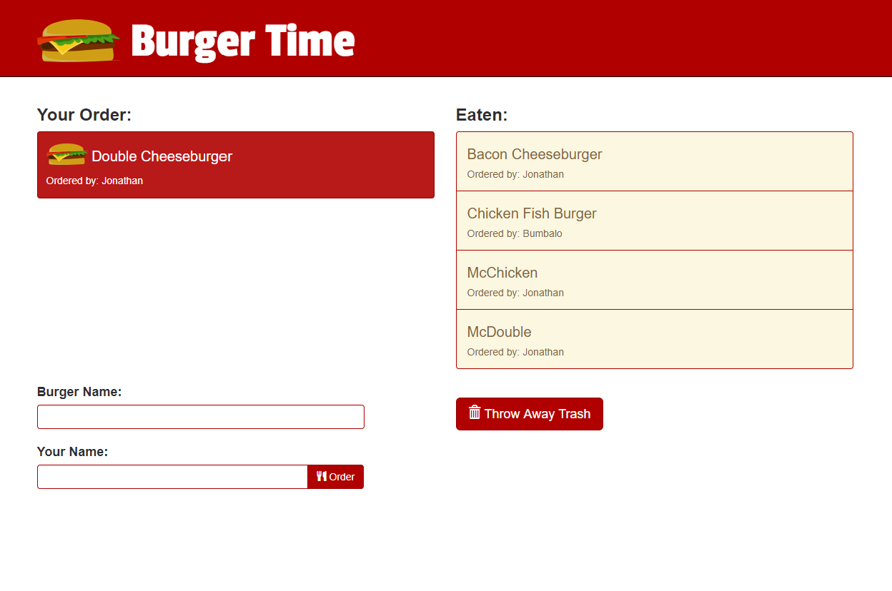

# Burger Time (Sequelize Version)
A restaurant app that lets users input the names of burgers they like to eat, using Node, Express, Sequelize, and Handlebars, based on the MVC design pattern.

## Prerequisites:
* Node.js

## Installation

* Download source code: `git clone https://github.com/jdwong415/sequelized-burger.git`

* Install modules: `npm install`

## Usage

* Run server: `node server.js`

* Open in browser: `http://localhost:8080`

* Input the name of the burger you'd like to eat. 

* Input your name.

* Click on the burger to eat it.

* Enjoy your meal.

* Don't forget to throw away your trash when you've finished eating.

## Demo
https://limitless-earth-86443.herokuapp.com/

